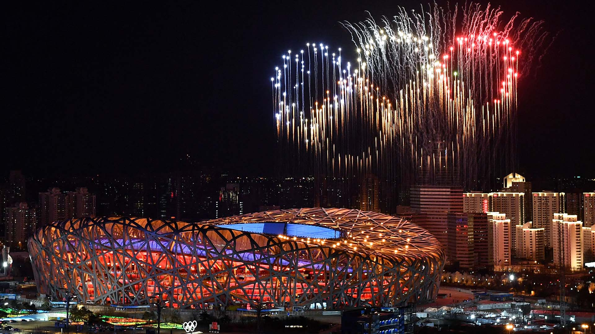

# Olympics DataAnalysis

### Overview
The Olympics dataset comprises information on athletes participating in various Olympic Games over the years. It includes details such as athlete ID, name, sex, age, physical attributes (height, weight), team, games participated in, year, season, city, sport, event, medals won, and additional information like region and notes
### Data Source
Olympics Data- Primary data  used here are "athlete_event.csv" and “noc_regions.csv” files
which are downloaded from online resource -Kaggle.com.
### Data Description
After merging both the datasets from athletes_event.csv and noc_regions.csv files,we have the following columns
-	'ID': Unique identifier for athletes
-	'Name': Name of the athlete
-	'Sex': Gender of the athlete
-	'Age': Age of the athlete
-	'Height': Height of the athlete
-	'Weight': Weight of the athlete
-	'Team': Representing team of the athlete
-	'NOC': National Olympic Committee code
-	'Games': Olympic Games participated in
-	'Year': Year of the Olympic Games
-	'Season': Season of the Olympic Games (Summer/Winter)
-	'City': Host city of the Games
-	'Sport': Sport in which the athlete competed
-	'Event': Specific event within the sport
-	'Medal': Type of medal won (Gold/Silver/Bronze)
-	'Region': Country or region the athlete represents
-	'Notes': Additional notes or information
### Tools
 - Pandas,Matplotlib,Seaborn for Data analysis and visualization.
### Analysis:
Potential areas of analysis include medal distribution, age-performance distribution, historical trends of gender-based participation, distribution of sports where different countries won medals etc.
### Insights
-	USA is the country who won most of the gold medals particularly in swimming.
-	Maximum participants are mostly from the age group between 20 and 30.
-	Over the course of years, female athletes’ participation increased significantly.
-	Height and weight of the athletes really matters in winning a medal.
-	Athletes who are aged above 60 who won gold medal are from the sport- Archery.
-	USA, Russia are top countries who won most of the medal’s count.

